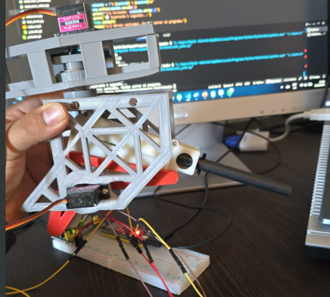
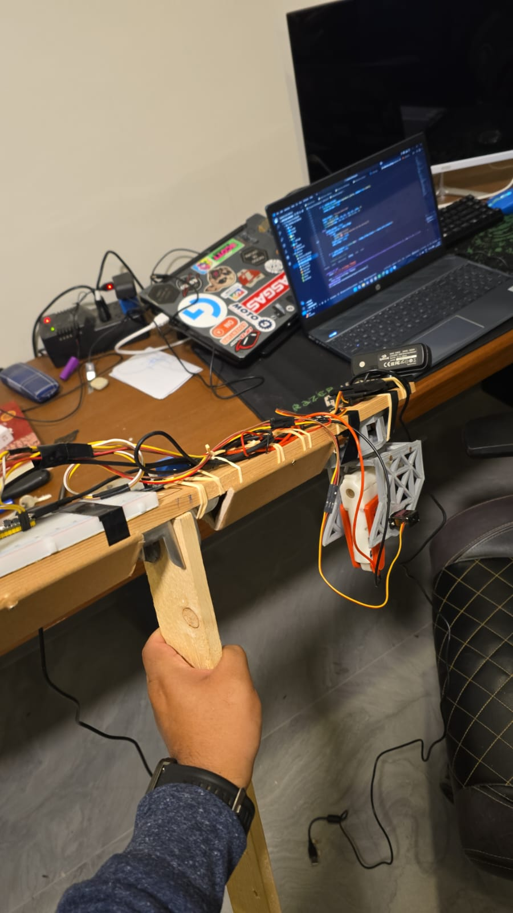
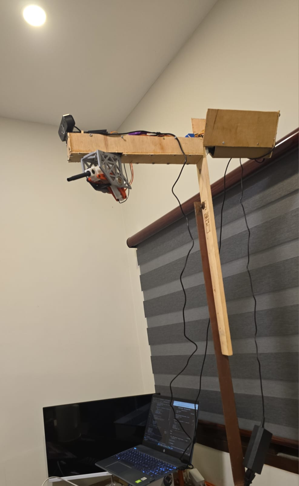
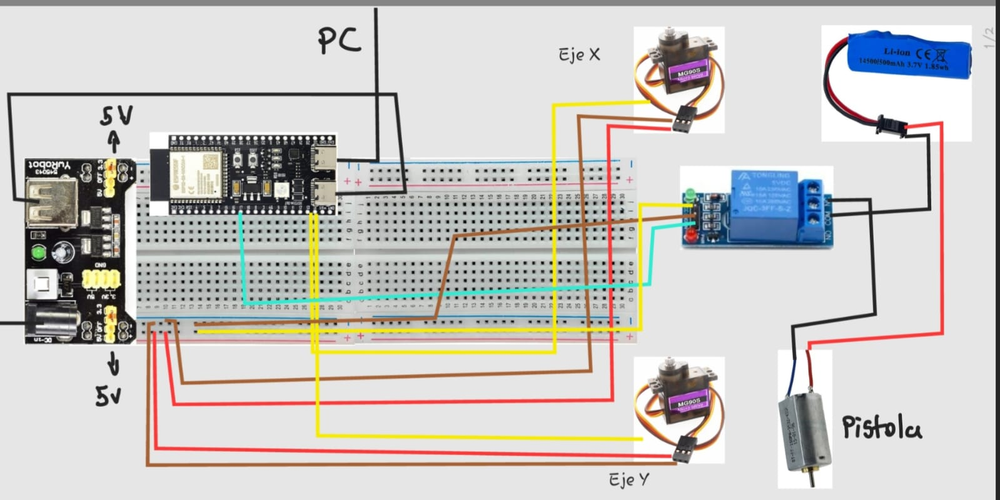
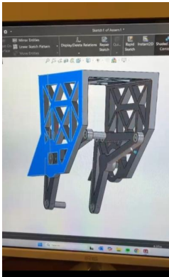

# Sistema de Cámara Defensiva Subletal

Sistema integrado para detección de movimientos en tiempo real mediante visión artificial y control de hardware. Este proyecto utiliza Python para procesamiento de video y detección, y C++ para el manejo de microcontroladores y servomotores que activan un mecanismo de disparo disuasivo.

---

## Descripción

Este sistema consta de dos partes principales que deben ejecutarse de forma secuencial para un correcto funcionamiento:

1. **Control de servomotores y microcontrolador ESP32:** Se carga y ejecuta el firmware en el ESP32 para controlar los servos y el mecanismo físico de disparo. Esta parte debe ejecutarse primero y, al finalizar, el proceso se detiene.

2. **Sistema de detección y control en Python:** Luego de detener el firmware, se ejecuta el código Python que inicia la transmisión en vivo, detecta movimientos en la zona definida usando YOLO, envía alertas y activa los servos mediante el microcontrolador cuando sea necesario.

Mientras el código Python esté en ejecución, el sistema funcionará en tiempo real activando las alertas y el mecanismo disuasivo.

---

## Características principales

- Detección en tiempo real de movimientos en zona segura usando visión artificial con YOLO.
- Control preciso de servomotores mediante ESP32 para mover la cámara y activar disparos disuasivos.
- Integración completa de software (Python y C++) y hardware (microcontroladores, servos y soporte físico).
- Diseño y fabricación del soporte físico de la cámara con SolidWorks e impresión 3D.

---

## Tecnologías usadas
- Python (OpenCV, YOLO para detección de movimiento).
    <p>
    
    </p>
- C++ para firmware en ESP32 (control de servomotores).
    <p>
    
    </p>
- Extensión PlatformIO IDE
    <p>
    
    </p>

- SolidWorks para modelado 3D.
- Impresión 3D para fabricación del soporte físico.
- Git para control de versiones.

---

## Instalación y ejecución

### Requisitos previos

- Visual Studio Code instalado.
- Extensión **PlatformIO IDE** instalada para programar y cargar firmware en ESP32.
- Python 3.8 o superior instalado en el sistema.
- Drivers para ESP32 instalados (PlatformIO usualmente los maneja).
- Librerías Python necesarias según `requirements.txt`.

### Pasos para iniciar el sistema en Visual Studio Code

1. **Abrir el proyecto**

   - Abre la carpeta del proyecto en Visual Studio Code.

2. **Ejecutar y cargar firmware en ESP32 (control de servos)**

   - En Visual Studio Code, abre la pestaña de PlatformIO.
   - En “Project Tasks”, selecciona el entorno ESP32.
   - Haz clic en `Build` para compilar el firmware.
   - Luego haz clic en `Upload` para cargarlo al ESP32 conectado.
   - Después de cargar, **ejecuta el firmware desde PlatformIO** para controlar los servos.
   - **Una vez que el proceso de control de servos finalice, detén la ejecución manualmente en PlatformIO** (parar tarea).

3. **Instalar librerías Python**

   - Abre una terminal en Visual Studio Code.
   - Ejecuta:

     ```bash
     pip install -r requirements.txt
     ```

4. **Ejecutar el script Python (detección y disparo)**

   - En la misma terminal, ejecuta:

     ```bash
     python main.py
     ```

## Capturas y Fotos del Sistema

Aquí puedes ver algunas imágenes de la cámara defensiva en funcionamiento y su montaje:

- Cámara defensiva vista lateral.
<p align="center">
    
</p>

- Montaje de conexiones.
<p align="center">
    
</p>

- Montaje final.
<p align="center">
    
</p>

- Conexiones.
<p align="center">
    
</p>

- Modelado de piezas en SolidWorks.
<p align="center">
    
</p>

## Especificaciones del Hardware

Este sistema está compuesto por los siguientes módulos electrónicos:

### Alimentación y conexión
- **Fuente USB de PC:** Proporciona energía al sistema desde el computador.
- **Protoboard + Módulo YwRobot:** Distribuye voltajes de 5V y 3.3V mediante fuente externa o USB.

### Microcontrolador
- **ESP32 DevKit v1:** Unidad central de control con conectividad Wi-Fi y Bluetooth. Envía señales PWM para servos y controla el módulo relay.

### Actuadores
- **2 Servomotores MG90S:** Controlan los movimientos en eje X e Y de la cámara.
- **Motor DC ("Pistola"):** Activado por un módulo relay para simular una acción disuasiva.

### Controlador de potencia
- **Módulo Relay de 1 canal:** Permite al ESP32 activar/desactivar el motor DC según la lógica del sistema.

### Fuente externa
- **Batería Li-Ion 3.7V (14500):** Alimenta el motor de la pistola a través del relay.

### Conexiones
- **Rojo:** VCC (5V)  
- **Negro/Marrón:** GND  
- **Amarillo/Celeste:** Señales PWM/control desde el ESP32 a los servos y relay


**Nota:** El sistema funciona en dos fases separadas: primero, se ejecuta el firmware en el ESP32 que controla los servos; una vez que ese proceso termina y es detenido, se inicia el script Python que realiza la detección, genera alertas y activa el mecanismo de disparo mediante el ESP32. Mientras el script Python esté en ejecución, el sistema estará activo y funcionando correctamente.
